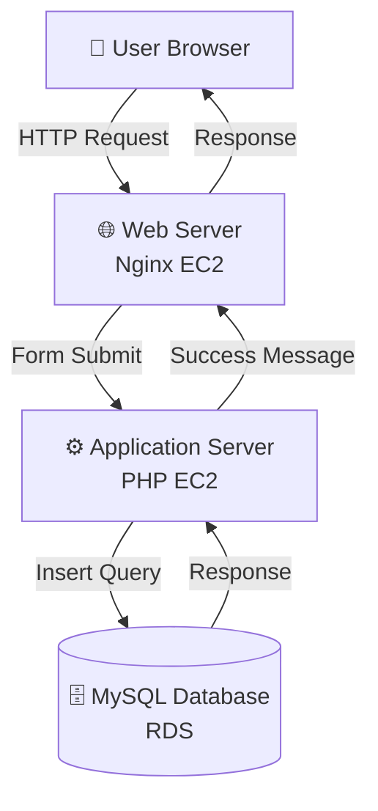
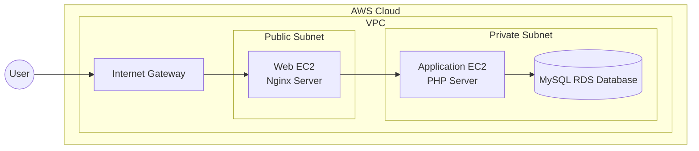
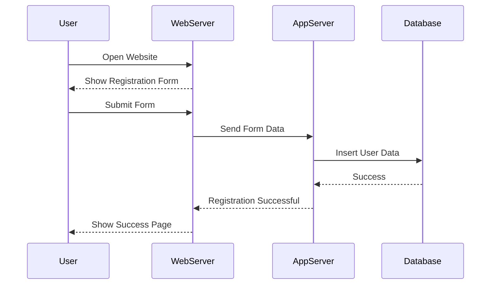

# 🚀 AWS Terraform 3-Tier DevOps Project


---

# 🌍 Project Overview

This project demonstrates the **deployment of a real-world 3-Tier Web Application Architecture on AWS using Terraform Infrastructure as Code (IaC)**.

The infrastructure automatically provisions a complete cloud environment consisting of:

🌐 **Web Tier** – Nginx server hosting the frontend registration form  
⚙ **Application Tier** – PHP backend server processing user requests  
🗄 **Database Tier** – MySQL database storing user registration data  

The project showcases **modern DevOps engineering practices** including:

- Infrastructure as Code (Terraform)
- Automated AWS provisioning
- Secure VPC networking
- Multi-tier application architecture
- Linux server automation

---

# 🏗 3-Tier Architecture

The application follows the **standard enterprise 3-Tier Architecture pattern**.

| Tier | Technology | Responsibility |
|-----|------------|---------------|
| Web Tier | Nginx | Handles HTTP requests |
| Application Tier | PHP | Processes backend logic |
| Database Tier | MySQL | Stores persistent data |

---

# 📊 Application Architecture Diagram



---

# ☁ AWS Cloud Infrastructure



---

# 🔁 Request Flow



---

# 🧰 Technology Stack

## ☁ Cloud Platform
- AWS EC2
- AWS VPC
- AWS RDS
- AWS Security Groups

## ⚙ DevOps Tools
- Terraform
- Git
- Linux (Ubuntu)

## 🌐 Application Stack
- Nginx
- PHP
- MySQL
- HTML

---

# 📂 Project Structure

```
aws-terraform-3tier-devops-project
│
├── main.tf
├── variables.tf
├── outputs.tf
├── terraform.tfvars
│
├── web.sh
├── app.sh
├── init.sql
│
├── modules
│   ├── vpc
│   ├── ec2
│   └── rds
│
└── README.md
```

---

# ⚙ Infrastructure Provisioned

Terraform automatically creates the following AWS resources:

### Network Layer
- VPC
- Public Subnet
- Private Subnet
- Internet Gateway
- Route Tables

### Compute Layer
- Web EC2 Instance
- Application EC2 Instance

### Database Layer
- MySQL RDS Instance

---

# 🔐 Security Architecture

Security best practices implemented:

✔ Web Server exposed to internet  
✔ App Server inside private subnet  
✔ Database inside private subnet  
✔ Security Groups restricting traffic  
✔ Database accessible only from App Server  

---

# 🗄 Database Schema

```sql
CREATE TABLE registration (
    id INT AUTO_INCREMENT PRIMARY KEY,
    name VARCHAR(100),
    email VARCHAR(100),
    phone VARCHAR(20)
);
```

---

# 📝 Registration Form Example

Example data submitted by users:

```
Name:  SUDARSHAN BHOSALE
Email: bhosalesudarshan2003@gmail.com
Phone: 7264965182
```

This information is stored in the **MySQL database**.

---

# 🚀 Deployment Guide

## 1️⃣ Clone Repository

```
git clone https://github.com/your-username/aws-terraform-3tier-devops-project.git
cd aws-terraform-3tier-devops-project
```

---

## 2️⃣ Initialize Terraform

```
terraform init
```

---

## 3️⃣ Validate Configuration

```
terraform validate
```

---

## 4️⃣ Review Infrastructure Plan

```
terraform plan
```

---

## 5️⃣ Deploy Infrastructure

```
terraform apply
```

Type:

```
yes
```

Terraform will automatically provision the entire infrastructure.

---

# 🌐 Access the Application

After deployment Terraform will output:

```
Web_Server_Public_IP
```

Open in your browser:

```
http://<Web_Server_Public_IP>
```

You will see the **Registration Form UI**.

---

# 📸 Screenshots

### Registration Form
(Add Screenshot Here)

### Successful Form Submission
(Add Screenshot Here)

### AWS Infrastructure
(Add Screenshot Here)

---

# 📈 DevOps Concepts Demonstrated

✔ Infrastructure as Code  
✔ Cloud Infrastructure Automation  
✔ Multi-Tier Architecture Design  
✔ Secure AWS Networking  
✔ Linux Server Provisioning  
✔ Web Application Deployment  

---

# 🎯 Real World Use Case

This architecture pattern is used in many **production systems**, including:

- SaaS applications
- Customer portals
- Online registration platforms
- Microservice web systems

---

# 🔮 Future Improvements

Possible enhancements:

- Application Load Balancer
- Auto Scaling Groups
- Docker Containerization
- Kubernetes Deployment
- Jenkins CI/CD Pipeline
- CloudWatch Monitoring
- AWS Secrets Manager

---

# 📚 Learning Outcomes

From this project you will learn:

- Terraform Infrastructure Automation
- AWS Network Architecture
- DevOps Deployment Workflow
- Secure Cloud Application Design

---

# 👨‍💻 Author

**sudarshan Bhosale**

Cloud & DevOps Engineer

Skills:
- AWS
- Terraform
- Docker
- Kubernetes
- Linux
- CI/CD

---

# ⭐ Support

If you like this project, consider giving it a ⭐ on GitHub!

---
## 📩 Connect With Me :-

If you’d like to collaborate, discuss projects, or just say hello — feel free to reach out!  

### 🔗 Social & Professional Links

- 💼 [LinkedIn](linkedin.com/in/sudarshan-bhosale-174477374)  
- 🐙 [GitHub](https://github.com/Sudarshan-Bhosale145)  
- ✉️ [Email](bhosalesudarshan2003@gmail.com)

💬 Always open for opportunities in **Cloud, DevOps, and Full-Stack Projects**
